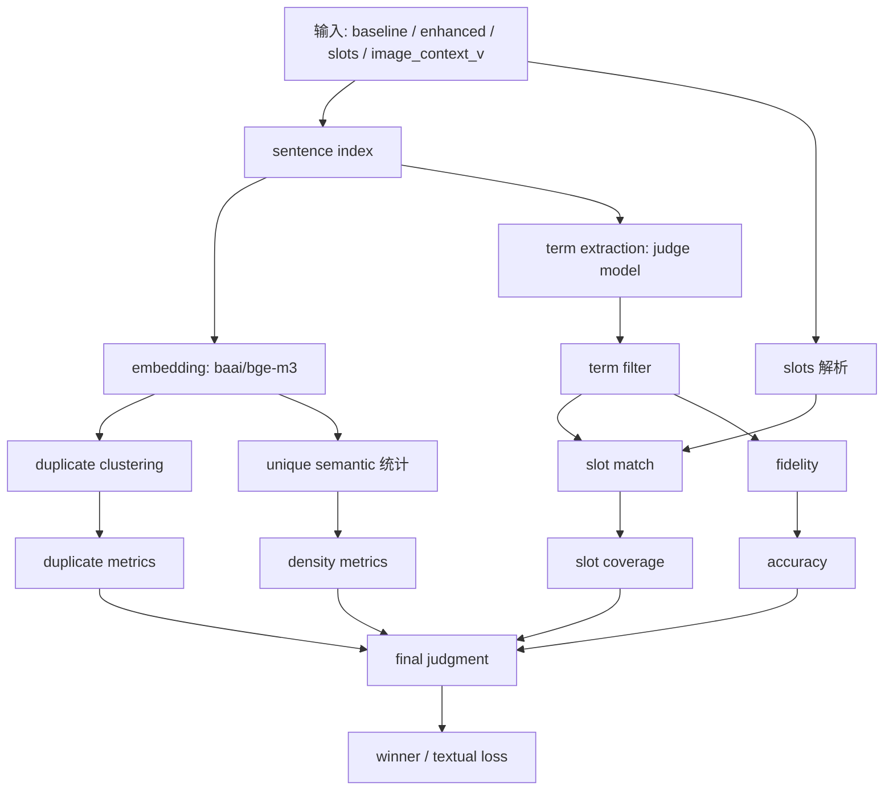
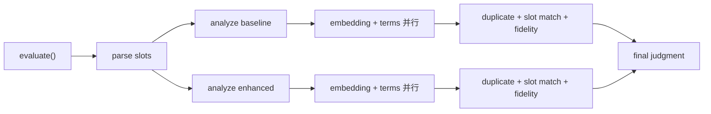

# Eval V2 技术报告

## 1. 项目定位

`eval_v2` 是一个面向中国画赏析文本的双文本对比评测系统。

输入：

- `context_baseline`
- `context_enhanced`
- `slots`
- `image_context_v`

输出：

- 语义重复度与语义多样性
- 国画专业术语抽取结果
- slot 覆盖结果
- fidelity 一致性结果
- 最终 `winner / textual_loss_for / textual_loss`

说明：

- `image_context_v` 不是图片本身
- 当前实现不直接看图，而是消费一段“视觉事实描述文本”

## 2. 快速使用

### 2.1 安装

```bash
cd /Users/ken/MM/Pipeline/eval_v2
python3 -m pip install -e .
export OPENAI_API_KEY="你的API Key"
```

默认配置：

- `base_url`: `https://api.zjuqx.cn/v1`
- `embedding_model`: `baai/bge-m3`
- `judge_model`: `openai/gpt-4.1`

### 2.2 用默认输入文件运行

```bash
cd /Users/ken/MM/Pipeline/eval_v2
python3 run_eval_v2.py
```

默认读取：

- `/Users/ken/MM/Pipeline/eval_v2/inputs/context_baseline.txt`
- `/Users/ken/MM/Pipeline/eval_v2/inputs/context_enhanced.txt`
- `/Users/ken/MM/Pipeline/eval_v2/inputs/slots.txt`
- `/Users/ken/MM/Pipeline/eval_v2/inputs/image_context_v.txt`

### 2.3 显式传文件

```bash
cd /Users/ken/MM/Pipeline/eval_v2
python3 run_eval_v2.py \
  --context-baseline-file ./inputs/context_baseline.txt \
  --context-enhanced-file ./inputs/context_enhanced.txt \
  --slots-file ./inputs/slots.txt \
  --image-context-v-file ./inputs/image_context_v.txt \
  --output-dir ./artifacts
```

### 2.4 直接传文本

```bash
cd /Users/ken/MM/Pipeline/eval_v2
python3 run_eval_v2.py \
  --context-baseline "文本A" \
  --context-enhanced "文本B" \
  --slots-text "重点关注馆藏、技法、题跋、印章等术语。" \
  --image-context-v "画面可见绢本、题跋、印章与具体设色信息。"
```

### 2.5 测试脚本

```bash
/Users/ken/MM/Pipeline/eval_v2/tests/test_eval.sh
```

## 3. 目录结构

```text
eval_v2/
├── guohua_eval/
│   ├── analyzer.py
│   ├── models.py
│   └── sentence_indexer.py
├── inputs/
├── tests/
├── artifacts/
├── run_eval_v2.py
├── README.md
└── TECHNICAL_REPORT.md
```

## 4. 总体逻辑

### 4.1 流程图



### 4.2 并行结构



## 5. 核心模块

### 5.1 CLI 入口

文件：

- [/Users/ken/MM/Pipeline/eval_v2/run_eval_v2.py](/Users/ken/MM/Pipeline/eval_v2/run_eval_v2.py)

职责：

- 解析参数
- 读取输入
- 初始化 `GuohuaEvalV2Analyzer`
- 调用 `evaluate()`
- 输出结果路径摘要 JSON

### 5.2 分句模块

文件：

- [/Users/ken/MM/Pipeline/eval_v2/guohua_eval/sentence_indexer.py](/Users/ken/MM/Pipeline/eval_v2/guohua_eval/sentence_indexer.py)

职责：

- 按 `。！？；\n` 切句
- 生成 `sentence_id`
- 估算 token 数量

### 5.3 数据模型

文件：

- [/Users/ken/MM/Pipeline/eval_v2/guohua_eval/models.py](/Users/ken/MM/Pipeline/eval_v2/guohua_eval/models.py)

关键模型：

- `SlotDefinition`
- `DuplicateCluster`
- `SemanticTerm`
- `SlotMatchRecord`
- `FidelityRecord`
- `ContextMetrics`
- `FinalJudgment`
- `EvalV2Result`

### 5.4 核心分析器

文件：

- [/Users/ken/MM/Pipeline/eval_v2/guohua_eval/analyzer.py](/Users/ken/MM/Pipeline/eval_v2/guohua_eval/analyzer.py)

主入口：

- `GuohuaEvalV2Analyzer.evaluate(...)`

职责：

- slots 解析
- embedding 调用
- 语义重复聚类
- 术语抽取与过滤
- slot 匹配
- fidelity 判定
- 最终裁判

## 6. 详细处理逻辑

### 6.1 slots 解析

`slots` 输入允许是自然语言，系统先将其解析为结构化 `slots_spec`：

```json
[
  {
    "slot_name": "技法",
    "description": "关注皴法、设色、笔法等",
    "covered_terms": ["披麻皴", "浅绛设色"]
  }
]
```

作用：

- 为 `slot match` 提供结构化输入
- 统计 `slots_number`
- 计算 `slot_coverage`

### 6.2 重复度测算

重复度不是 LLM 主观评分，而是句子级 embedding 聚类：

1. 每句调用 `baai/bge-m3` 获取向量
2. 句子两两计算 cosine similarity
3. 若相似度 `>= duplicate_threshold`，则合并到同一语义簇
4. 使用并查集得到重复语义 cluster

核心指标：

- `similar_semantic_num`
- `duplicate_sentence_num`
- `unique_semantic_num`
- `duplicate_rate = duplicate_sentence_num / sentence_count`

默认阈值：

- `duplicate_threshold = 0.83`

当前是“连通分量式聚类”，不是严格 clique。

### 6.3 术语抽取与过滤

系统先让 judge model 抽取中国画专业术语，再做一层本地过滤。

抽取目标：

- 具体技法名称
- 具体设色法
- 皴法 / 描法 / 墨法
- 材质
- 装裱形制
- 尺寸
- 朝代
- 馆藏机构 / 地点
- 题跋作者 / 内容
- 印章释文 / 印主
- 款识 / 定名 / 登录号

过滤掉的宽泛词包括：

- `笔墨`
- `线条`
- `笔触`
- `笔法`
- `构图`
- `色彩`
- `气韵`
- `意境`
- `中国山水画`
- `天人合一`

当前术语链路是：

```text
LLM 候选抽取 + 本地规则过滤
```

### 6.4 slot match

`slot match` 判断的是：

- 已抽取术语中，有哪些命中了用户定义的 `slots_spec`

输入：

- `slots_spec`
- 过滤后的 `terms`

输出字段：

- `slot_name`
- `matched_terms`
- `matched_categories`
- `sentence_ids`
- `reason`

统计值：

- `slots_match = 命中的唯一 slot 数量`
- `slot_coverage = slots_match / slots_number`

### 6.5 fidelity

`fidelity` 评估的是：

> 文本里抽取出的术语，是否被 `image_context_v` 这个视觉基准文本直接支持

它衡量的不是“写得美不美”，而是“写得准不准”。

统计值：

- `accuracy = supported_term_count / term_num`

如果 `image_context_v` 为空：

- fidelity 不会中断流程
- 条目会被标记为无法判定视觉支持关系

### 6.6 最终裁判

最后一步把两边的统计指标和中间证据拼到最终 prompt 中，输出：

- `winner`
- `textual_loss_for`
- `reasoning`
- `textual_loss`

主要参考指标：

- `information_density`
- `duplicate_rate`
- `slot_coverage`
- `accuracy`

辅助证据：

- 重复语义簇
- 术语清单
- fidelity 记录

## 7. 输入结构

### 7.1 运行时输入

#### `context_baseline`

- 类型：`str`
- 含义：基准赏析文本

#### `context_enhanced`

- 类型：`str`
- 含义：增强赏析文本

#### `slots_input`

- 类型：`str`
- 含义：用户对重点评测维度的自然语言描述

示例：

```text
重点关注馆藏、技法、题跋与印章相关术语，以及这些术语是否被准确展开。
```

#### `image_context_v`

- 类型：`str`
- 含义：视觉线索基准的文本化描述，不是图片本身

示例：

```text
画面可见绢本材质、主峰巨岩、右下角驴队、右侧瀑布，题跋署石涛，并见多方印章。
```

### 7.2 中间结构

#### `slots_spec`

```json
[
  {
    "slot_name": "技法",
    "description": "关注皴法、设色、笔法等",
    "covered_terms": ["雨点皴", "浅绛设色"]
  }
]
```

#### `indexed_sentences`

```json
[
  {"sentence_id": 0, "text": "第一句。"},
  {"sentence_id": 1, "text": "第二句。"}
]
```

## 8. 输出结构

### 8.1 CLI 标准输出

运行完成后，CLI 会打印一个摘要 JSON：

```json
{
  "result_json_path": ".../artifacts/eval_v2_result.json",
  "baseline_duplicate_clusters_jsonl": ".../artifacts/baseline_duplicate_clusters.jsonl",
  "baseline_terms_jsonl": ".../artifacts/baseline_terms.jsonl",
  "baseline_slot_matches_jsonl": ".../artifacts/baseline_slot_matches.jsonl",
  "baseline_fidelity_jsonl": ".../artifacts/baseline_fidelity.jsonl",
  "enhanced_duplicate_clusters_jsonl": ".../artifacts/enhanced_duplicate_clusters.jsonl",
  "enhanced_terms_jsonl": ".../artifacts/enhanced_terms.jsonl",
  "enhanced_slot_matches_jsonl": ".../artifacts/enhanced_slot_matches.jsonl",
  "enhanced_fidelity_jsonl": ".../artifacts/enhanced_fidelity.jsonl",
  "winner": "context_enhanced",
  "textual_loss_for": "context_baseline"
}
```

### 8.2 `eval_v2_result.json`

```json
{
  "base_url": "https://api.zjuqx.cn/v1",
  "embedding_model": "baai/bge-m3",
  "judge_model": "openai/gpt-4.1",
  "duplicate_threshold": 0.83,
  "slots_input": "...",
  "slots_number": 3,
  "slots_spec": [...],
  "image_context_v": "...",
  "context_baseline_metrics": {...},
  "context_enhanced_metrics": {...},
  "final_judgment": {...},
  "output_dir": ".../artifacts",
  "result_json_path": ".../artifacts/eval_v2_result.json",
  "llm_tokens": 12345
}
```

### 8.3 `ContextMetrics`

```json
{
  "context_name": "context_baseline",
  "sentence_count": 12,
  "token_count": 430,
  "similar_semantic_num": 2,
  "duplicate_sentence_num": 5,
  "unique_semantic_num": 9,
  "term_num": 8,
  "slots_match": 3,
  "accuracy": 0.75,
  "duplicate_rate": 0.4167,
  "information_density": 0.0209,
  "slot_coverage": 0.6,
  "duplicate_clusters": [...],
  "terms": [...],
  "slot_matches": [...],
  "fidelity_records": [...],
  "duplicate_clusters_jsonl": "...",
  "terms_jsonl": "...",
  "slot_matches_jsonl": "...",
  "fidelity_jsonl": "..."
}
```

### 8.4 关键子结构

#### `DuplicateCluster`

```json
{
  "cluster_id": 0,
  "sentence_ids": [2, 5],
  "sentences": ["句子A", "句子B"],
  "avg_similarity": 0.9123
}
```

#### `SemanticTerm`

```json
{
  "term": "雨点皴",
  "category": "皴法",
  "detail": "文本明确指出山壁采用雨点皴。",
  "sentence_ids": [4],
  "evidence_sentences": ["山壁上的雨点皴拉长了视觉高度。"]
}
```

#### `SlotMatchRecord`

```json
{
  "slot_name": "技法",
  "matched_terms": ["雨点皴"],
  "matched_categories": ["皴法"],
  "sentence_ids": [4],
  "reason": "该术语是具体末端技法，不是泛类描述。"
}
```

#### `FidelityRecord`

```json
{
  "term": "石涛",
  "category": "题跋作者",
  "supported_by_ground_truth": true,
  "reason": "视觉线索基准明确提到题跋署石涛。"
}
```

#### `FinalJudgment`

```json
{
  "winner": "context_enhanced",
  "textual_loss_for": "context_baseline",
  "reasoning": "文本B在术语精度与 slot 覆盖上更完整。",
  "textual_loss": "文本A的冗余主要集中在若干重复簇，同时忽略了题跋与印章细节。"
}
```

## 9. 输出文件清单

每次运行会生成：

- `baseline_duplicate_clusters.jsonl`
- `baseline_terms.jsonl`
- `baseline_slot_matches.jsonl`
- `baseline_fidelity.jsonl`
- `enhanced_duplicate_clusters.jsonl`
- `enhanced_terms.jsonl`
- `enhanced_slot_matches.jsonl`
- `enhanced_fidelity.jsonl`
- `eval_v2_result.json`

## 10. 指标定义

### 10.1 信息密度

```text
information_density = unique_semantic_num / token_count
```

### 10.2 语义重复率

```text
duplicate_rate = duplicate_sentence_num / sentence_count
```

### 10.3 专业 Slot 覆盖率

```text
slot_coverage = slots_match / slots_number
```

### 10.4 术语准确度 Fidelity

```text
accuracy = supported_term_count / term_num
```

## 11. 失败模式与注意事项

- 未设置 `OPENAI_API_KEY` 会导致客户端初始化失败
- embedding 模型不可用时，会报服务端 503 或模型不可用错误
- `image_context_v` 为空时，fidelity 无法有效比较
- 当前系统不直接看图，只消费文本版视觉基准
- 重复度是连通分量聚类，不是严格 pairwise 完全重复

## 12. 代码入口索引

- CLI：[/Users/ken/MM/Pipeline/eval_v2/run_eval_v2.py](/Users/ken/MM/Pipeline/eval_v2/run_eval_v2.py)
- 分析器：[/Users/ken/MM/Pipeline/eval_v2/guohua_eval/analyzer.py](/Users/ken/MM/Pipeline/eval_v2/guohua_eval/analyzer.py)
- 模型：[/Users/ken/MM/Pipeline/eval_v2/guohua_eval/models.py](/Users/ken/MM/Pipeline/eval_v2/guohua_eval/models.py)
- 分句器：[/Users/ken/MM/Pipeline/eval_v2/guohua_eval/sentence_indexer.py](/Users/ken/MM/Pipeline/eval_v2/guohua_eval/sentence_indexer.py)
- 测试：[/Users/ken/MM/Pipeline/eval_v2/tests/test_eval_v2.py](/Users/ken/MM/Pipeline/eval_v2/tests/test_eval_v2.py)
