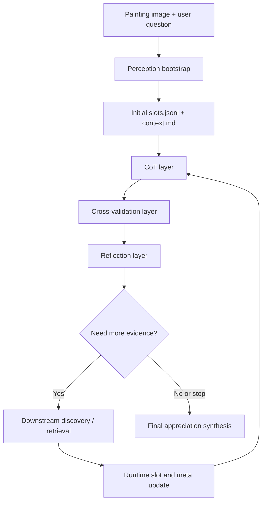

# ArtFlow Technical Report

## 1. Purpose

ArtFlow is a closed-loop analysis system for Chinese painting appreciation. Its design target is not simply to generate a fluent description of an image, but to build a reusable analysis workflow that can:

1. identify the work through slot-based structured understanding,
2. iteratively expand evidence through reasoning and retrieval,
3. preserve useful intermediate findings instead of discarding them between rounds,
4. produce a final appreciation that remains grounded in visual evidence, catalog facts, and domain knowledge.

For paper writing, the most important framing is this:

- the system is **not** a single prompt pipeline;
- it is a **multi-stage, slot-centric, retrieval-augmented closed loop**;
- each stage is responsible for a different type of uncertainty reduction.

## 2. Problem Setting

Chinese painting appreciation is difficult for a one-shot multimodal model for several reasons:

- the relevant evidence is distributed across visual clues, art-historical metadata, and domain-specific terminology;
- some facts are directly visible, while others require catalog lookup or comparison with known works;
- different analytical dimensions, such as author attribution, brushwork, composition, inscription, and mounting, have very different retrieval needs;
- information discovered in one round is easy to lose if the system does not explicitly retain and re-inject it downstream.

ArtFlow addresses this by decomposing the task into slots and letting each slot evolve across rounds.

## 3. High-Level Contributions

From an implementation and methods perspective, the current version contributes five key ideas:

### 3.1 Slot-centric decomposition

Instead of asking the model to directly write an appreciation, the pipeline first bootstraps a set of slots such as:

- work background,
- author / period / school,
- brushwork and coloring,
- composition / spatial layout,
- material / mounting / collection,
- inscription / seals / brush handling,
- iconography / symbolism.

Each slot contains:

- `slot_name`,
- `slot_term`,
- `description`,
- `specific_questions`,
- metadata controlling whether the slot is progressive or enumerative.

This gives the system a stable reasoning scaffold.

### 3.2 Closed-loop reasoning rather than one-pass reasoning

The system runs in rounds. In each round it:

1. executes slot-level CoT analysis,
2. cross-checks the current answers,
3. decides which gaps are still worth pursuing,
4. launches new reasoning or downstream retrieval tasks,
5. merges new evidence back into runtime state.

This makes the final output cumulative rather than tied to the last prompt.

### 3.3 Retrieval source routing

The system separates:

- short, stable term queries for local RAG,
- multi-term entity- and comparison-heavy queries for web search,
- hybrid tasks that benefit from both.

This prevents technical slots and catalog slots from being forced into the same retrieval format.

### 3.4 Fact retention across rounds

Earlier versions lost useful facts when those facts were present in slot descriptions but not explicitly consumed in the current answer. The current design adds:

- `retained_facts`,
- `rag_cache`,
- `round_memories`,
- `final_slot_summaries`,

so that intermediate author, collection, material, and contextual facts can survive until the final synthesis stage.

### 3.5 Slot-complete final synthesis

The final appreciation is no longer generated only from the latest slot outputs. It now uses cumulative outputs plus slot-level must-cover facts, reducing the chance that author information or collection details disappear in the last generation step.

## 4. Repository Layout

The implementation is organized into four main layers plus one companion evaluation toolkit:

```text
final_version/
├── pics/
│   ├── main.py
│   └── closed_loop.py
├── preception_layer/
│   └── perception_layer/
├── src/
│   ├── common/
│   ├── cot_layer/
│   ├── cross_validation_layer/
│   └── reflection_layer/
└── tests/

cluster_match/
├── cluster_match/
├── run_cluster_match.py
├── evaluate_cluster_match_results.py
└── analyze_cluster_match_results.py
```

Notes:

- The directory name `preception_layer` is preserved for compatibility with the existing codebase.
- `cluster_match/` is a companion toolkit for structured extraction and evaluation; it is not part of the runtime appreciation loop, but it is part of the research workflow.

## 5. End-to-End Workflow



The workflow can be understood as a sequence of uncertainty filters:

- bootstrap reduces uncertainty about the work identity and initial analytical dimensions,
- CoT reduces uncertainty within each slot,
- validation identifies what is still missing,
- reflection decides where to spend the next budget,
- downstream discovery imports external evidence,
- final synthesis integrates the cumulative state.

## 6. Layer-by-Layer Description

## 6.1 Perception bootstrap

Implementation entry:

- [`preception_layer/perception_layer/pipeline.py`](./preception_layer/perception_layer/pipeline.py)

Inputs:

- painting image,
- user prompt,
- optional metadata context,
- external search and embedding configuration.

Outputs:

- `slots.jsonl`,
- `context.md`,
- initial retrieval traces,
- early metadata candidates.

Role in the paper:

- this is the **front-end grounding stage**,
- it initializes the slot schema,
- it provides the first domain profile and text evidence that later stages reuse.

The bootstrap stage should be described as a hybrid of:

- visual understanding,
- metadata anchoring,
- slot schema initialization.

## 6.2 CoT layer

Core files:

- [`src/cot_layer/pipeline.py`](./src/cot_layer/pipeline.py)
- [`src/cot_layer/closed_loop.py`](./src/cot_layer/closed_loop.py)
- [`src/cot_layer/models.py`](./src/cot_layer/models.py)

The CoT layer is responsible for:

- thread creation and scheduling,
- parallel slot-level reasoning,
- slot-term progression,
- aggregation of per-slot outputs,
- maintaining runtime state across rounds.

Each `DomainCoTRecord` includes:

- visual anchoring,
- domain decoding,
- cultural mapping,
- question coverage,
- unresolved points,
- optional retrieval-gain planning.

This separation is important for writing because it shows that ArtFlow does not treat all knowledge as one homogeneous text blob. It distinguishes:

- what is seen,
- what is inferred,
- what is mapped to external art-historical knowledge,
- what remains unresolved.

## 6.3 Cross-validation layer

Core files:

- [`src/cross_validation_layer/prompt_builder.py`](./src/cross_validation_layer/prompt_builder.py)
- [`src/cross_validation_layer/service.py`](./src/cross_validation_layer/service.py)

This layer performs a round-table style review over the current slot outputs. Its job is to identify:

- blind spots,
- unanswered questions,
- redundant or low-value follow-up directions,
- slot lifecycle status.

In paper terms, this stage is a **meta-reasoning and quality-control layer**. It does not create the final answer; it audits whether the current answer is sufficiently detailed and evidence-grounded.

## 6.4 Reflection layer

Core files:

- [`src/reflection_layer/prompt_builder.py`](./src/reflection_layer/prompt_builder.py)
- [`src/reflection_layer/service.py`](./src/reflection_layer/service.py)

The reflection layer converts validated gaps into executable next steps. It handles:

- retrieval planning,
- task spawning,
- duplicate suppression,
- convergence checks,
- final appreciation prompting.

This layer is where the system decides whether a follow-up should:

- continue as slot-level CoT,
- be escalated to downstream discovery,
- or be closed because further effort would likely add little value.

## 6.5 Downstream discovery

Downstream discovery is used when the current round lacks catalog or contextual evidence that is unlikely to emerge from visual reasoning alone.

Typical downstream targets include:

- collection and accession details,
- official material and mounting descriptions,
- author background and comparison references,
- series-level comparison data.

This stage merges external evidence back into slot descriptions, text evidence updates, and retained facts.

## 7. Retrieval Design

## 7.1 Why retrieval must be differentiated

Not all art-historical questions are retrieval-equivalent.

Examples:

- `铁线描` is a compact, stable technical term and is well suited to local RAG.
- `东京国立博物馆 十六罗汉图第十一尊者 收藏编号` is an entity-heavy web-style query.
- `金大受 罗汉题材 背景处理 比较` often benefits from hybrid retrieval.

The current pipeline therefore distinguishes:

- `rag_queries`: short and stable term queries,
- `web_queries`: multi-term web search queries,
- `retrieval_mode`: `rag`, `web`, or `hybrid`.

## 7.2 Web search pipeline

When web search is enabled in [`config.yaml`](./config.yaml), the pipeline can:

1. call a Serper-compatible search API,
2. take the top search hits,
3. rerank candidate pages,
4. fetch the selected pages,
5. convert page content into the same downstream document format used by RAG.

This design is useful for paper writing because it shows that retrieval is not treated as a monolithic black box. The system explicitly models source selection.

## 7.3 Cache-first reuse

The closed loop reuses retrieval results through:

- `post_rag_text_extraction`,
- `downstream_rag_cache.json`,
- runtime `rag_cache`.

This avoids repeated queries across rounds and supports cumulative evidence growth.

## 8. Memory and State Management

One of the main engineering lessons in this project is that iterative analysis fails if the system does not explicitly preserve intermediate findings.

The current runtime state includes:

- `round_memories`: compact per-round summaries,
- `retained_facts`: stable facts that should survive even if they were not directly consumed in the current answer,
- `downstream_updates`: merged downstream discoveries,
- `rag_cache`: reusable retrieval evidence,
- `dialogue_turns`: coarse interaction history,
- `final_slot_summaries`: cleaned slot descriptions for final synthesis.

This is especially important for author, collection, and material facts. Such facts are often:

- present in descriptions,
- relevant to the final appreciation,
- but not always part of the immediate question being answered in a single CoT call.

Without explicit retention, they are easy to lose.

## 9. Slot Evolution and Guardrails

The pipeline uses several mechanisms to stop slot drift and repeated low-value exploration.

### 9.1 Slot term progression

Progressive and enumerative slots move through candidate terms across rounds. This supports a structured analysis trajectory instead of repeatedly restating the same slot head.

### 9.2 Slot family guard

Fixed slots now use term-family constraints so that:

- author slots do not drift into pure technique terms,
- material / collection slots do not drift into dynasty or iconography terms.

This matters for the paper because it shows that the system does not rely on the language model alone to maintain semantic boundaries; it supplements the model with lightweight symbolic constraints.

### 9.3 Lifecycle review

Each slot can be marked `ACTIVE`, `STABLE`, or `CLOSED`.

This prevents:

- endless follow-up spawning,
- repeated low-yield retrieval,
- overfitting to rhetorical rather than evidential questions.

## 10. Final Appreciation Synthesis

The final appreciation stage is designed to answer a user-facing question, but it is driven by cumulative structured evidence.

Its inputs now include:

- cumulative slot outputs,
- retained facts,
- background knowledge,
- unresolved questions,
- required slot coverage,
- cleaned slot summaries.

The current design explicitly addresses a failure mode observed in earlier runs:

- useful facts in slot descriptions, such as author background or collection context, could disappear in the final answer if they were not repeated in the last round.

To reduce this failure:

- slot description highlights are extracted and cleaned,
- must-cover facts are grouped by slot,
- the final-answer prompt explicitly instructs the model not to omit those facts.

For paper writing, this can be described as a **slot-complete evidence consolidation mechanism**.

## 11. Typical Failure Modes

The following failure modes are important enough to report explicitly:

### 11.1 Retrieval quality mismatch

Local RAG may fail on:

- museum collection identifiers,
- accession records,
- specific author biographies,
- cross-work comparison documents.

This motivated the introduction of web search routing.

### 11.2 Slot drift

Without slot family guardrails, author slots may drift into technical descriptors and material slots may drift into generic period labels.

### 11.3 Final-stage compression loss

Even when the runtime state contains useful evidence, the final generator may omit it if the prompt does not explicitly preserve slot coverage.

### 11.4 False certainty from analogical evidence

A retrieved text may describe a similar work rather than the target work itself. This is especially risky for:

- dimensions,
- accession numbers,
- series-level comparison,
- non-visible inscription content.

The system therefore prefers conservative wording when evidence remains indirect.

## 12. Companion Evaluation Toolkit: `cluster_match`

The repository includes a companion module in [`../cluster_match`](../cluster_match) for structured evaluation.

Its role is:

- extract structured factors from generated appreciation text,
- normalize outputs into a predefined schema,
- compare enhanced outputs against baseline or reference outputs,
- compute score summaries and generate analysis tables and figures.

In the paper, `cluster_match` can be presented as:

- a post-hoc evaluation layer,
- a factor-level comparison tool,
- or a structured metrics harness for appreciation outputs.

This is useful because freeform appreciation quality is difficult to measure with surface-level text overlap alone.

## 13. Reproducibility and Outputs

Important runtime artifacts include:

- `perception_bootstrap/slots.jsonl`,
- `perception_bootstrap/context.md`,
- `slots_rounds/*/domain_outputs.json`,
- `slots_rounds/*/cross_validation.json`,
- `downstream_rounds/*/task_*_payload.json`,
- `runtime_state/slots_final.jsonl`,
- `runtime_state/downstream_rag_cache.json`,
- `final_appreciation_prompt.md`.

These outputs provide a traceable path from image input to final appreciation, which is useful for:

- ablation studies,
- failure analysis,
- qualitative examples in the paper appendix.

## 14. Suggested Paper Framing

If your colleague is writing the methods section, the cleanest structure is:

### 14.1 Task framing

Describe the task as **grounded Chinese painting appreciation with iterative evidence acquisition**.

### 14.2 System framing

Describe ArtFlow as a **multi-layer slot-based closed-loop framework** with:

- perception bootstrap,
- slot-level CoT reasoning,
- cross-slot validation,
- retrieval-aware reflection,
- downstream evidence merge,
- final synthesis.

### 14.3 Key claims

The strongest claims supported by the codebase are:

- structured slots improve controllability over analytical dimensions,
- closed-loop review improves coverage over one-pass generation,
- retrieval routing better matches heterogeneous evidence needs,
- retained facts reduce information loss in the final appreciation.

### 14.4 What to avoid over-claiming

The current system should not be described as:

- a guaranteed attribution engine,
- a fully reliable catalog retrieval system,
- a complete substitute for expert art-historical judgment.

A better description is:

- a controllable analysis assistant that combines visual evidence, external knowledge, and iterative review.

## 15. Future Work

Natural next steps include:

- richer retrieval confidence calibration,
- stronger page-level citation handling for web evidence,
- better comparison across related works within the same series,
- larger-scale evaluation with `cluster_match`,
- human expert review on final appreciation quality and factual grounding.

## 16. Minimal Run Commands

Single-pass run:

```bash
cd /Users/ken/MM/Pipeline/final_version
python pics/main.py --config config.yaml --image /absolute/path/to/painting.jpg
```

Closed-loop run:

```bash
cd /Users/ken/MM/Pipeline/final_version
python pics/closed_loop.py \
  --config config.yaml \
  --image /absolute/path/to/painting.jpg \
  --text "请对这幅国画做严谨分析。"
```

Test:

```bash
cd /Users/ken/MM/Pipeline/final_version
PYTHONPATH=/Users/ken/MM/Pipeline/final_version pytest tests -q
```

Companion evaluation:

```bash
cd /Users/ken/MM/Pipeline/cluster_match
python run_cluster_match.py
python evaluate_cluster_match_results.py --judge-mode exact
```
