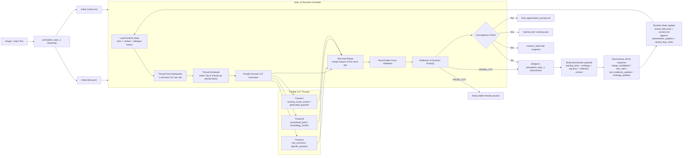
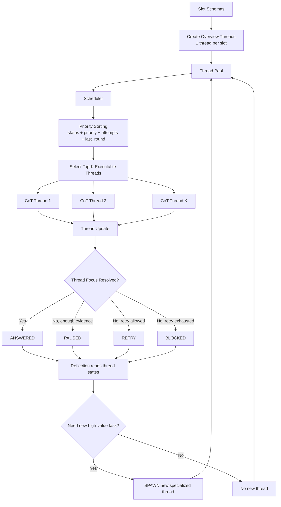
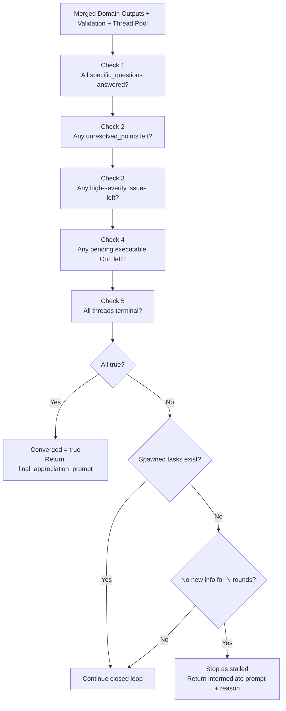

# slots_v2 Technical Report

## 1. 目标

`slots_v2` 的目标已经从“单轮槽位分析”升级成“可闭环、可收敛的国画动态推理系统”。

它现在承担两层职责：

1. 在 `slots_v2` 内部维护多轮 `CoTThread` 线程池，动态生成、暂停、复用和收敛 CoT
2. 把 Reflection 层发现的未解问题转成 `preception_layer_1` 的 downstream task，再把补回来的结构化结果回灌到下一轮分析

这意味着系统不再只是“分析一次”，而是可以持续补：

- 哪些问题还没答完
- 哪些槽位还缺文字证据
- 哪些本体关系需要补链
- 哪些问题只是重复，需要删除
- 什么时候真正可以停止扩张，输出最终赏析 prompt

## 2. 代码入口

- `slots_v2` 多轮推理主引擎：
  [pipeline.py](/Users/ken/MM/Pipeline/final_version/src/slots_v2/pipeline.py)
- `slots_v2` 与 `preception_layer_1` 的闭环 bridge：
  [closed_loop.py](/Users/ken/MM/Pipeline/final_version/src/slots_v2/closed_loop.py)
- `slots_v2` 单独 CLI：
  [main.py](/Users/ken/MM/Pipeline/final_version/pics/main.py)
- 闭环 CLI：
  [closed_loop.py](/Users/ken/MM/Pipeline/final_version/pics/closed_loop.py)
- `preception_layer_1` bootstrap 主流程：
  [cli.py](/Users/ken/MM/Pipeline/preception_layer_1/perception_layer/cli.py)
- `preception_layer_1` downstream runner：
  [downstream.py](/Users/ken/MM/Pipeline/preception_layer_1/perception_layer/downstream.py)

## 3. 总体闭环

本节给出 3 张可直接用于论文撰写的 Mermaid 图。

- 图 1：系统总览主图，最适合放正文方法总框架
- 图 2：CoT 线程池动态机制图，适合解释并行与调度
- 图 3：收敛判据图，适合解释停止条件与最终输出

### 3.1 图 1：闭环主图



建议图注：
`Figure 1. Closed-loop dynamic agent pipeline with parallel CoT scheduling, reflection-driven downstream expansion, and convergence-controlled appreciation generation.`

### 3.2 图 2：CoT 线程池动态机制图



建议图注：
`Figure 2. Dynamic thread-pool management for parallel CoT execution, thread-state transition, and reflection-based thread spawning.`

### 3.3 图 3：收敛判据图



建议图注：
`Figure 3. Convergence criteria and stopping logic for distinguishing true convergence from stalled iterative refinement.`

## 4. 各环节作用、输入与输出

### 4.1 Bootstrap Layer

作用：
用 `preception_layer_1` 对图像做第一次领域感知，生成最初的 `slots.jsonl` 和 `context.md`。

输入：

- `image`
- `input_text`
- API / RAG / embedding 配置

输出：

- `perception_bootstrap/slots.jsonl`
- `perception_bootstrap/context.md`
- `perception_bootstrap/rag_search_record.md`
- `perception_bootstrap/llm_chat_record.jsonl`

为什么需要它：
`slots_v2` 不擅长从零做术语发现和初始 RAG grounding；bootstrap 层负责先把“图像里可能值得分析的槽位和术语”拉出来。

### 4.2 Domain CoT Layer

作用：
针对每个槽位初始化一个 `slot_overview` 线程，再根据 Reflection 动态扩出更细的线程，比如：

- `specific_question_unanswered`
- `unresolved_point`
- `missing_visual_anchor`
- `chronology_conflict`

输入：

- 高分辨率图像
- 当前轮 runtime `slots.jsonl`
- runtime `context.md` 解析出的 meta
- 线程上下文 `thread_context`

输出：

- `domain_outputs.json`
- `cot_threads.json`
- `dialogue_state.json`

为什么需要它：
它负责把“槽位 schema”落实为真正的视觉证据、术语解码和文化映射，而不是停留在 schema 描述层。

### 4.3 Round-table Cross-Validation

作用：
对所有 CoT 输出做第二层逻辑复核，查：

- 视觉锚点是否稳定
- `specific_questions` 是否被真正回答
- 是否出现时空冲突
- 是否出现语义重复

输入：

- 当前轮 `domain_outputs`
- 当前 meta
- `slots.jsonl`

输出：

- `cross_validation.json`
- `removed_questions`
- `rag_terms`
- `semantic_duplicates`

为什么需要它：
它避免系统在多个线程同时推进时，出现“答非所问”“重复夸一遍留白”“把清代图式缝到北宋画里”这种错误。

### 4.4 Reflection & Dynamic Routing

作用：
根据未解决问题和冲突动态决定：

- `SPAWN_COT`
- `PAUSE_COT`
- `converged=true/false`

输入：

- `domain_outputs`
- `cross_validation`
- 当前 `CoTThread` 池
- `DialogueState`

输出：

- `routing.json`
- `spawned_tasks`
- `answered_slots`
- `convergence_reason`

为什么需要它：
它是系统的调度器，负责控制 CoT 数量和内容，避免无限增殖，也避免过早停止。

### 4.5 Downstream Bridge

作用：
把 Reflection 产生的 `spawned_tasks` 映射为 `preception_layer_1` 的 downstream payload，再调用 `DownstreamPromptRunner.run_json()`。

输入：

- `routing.spawned_tasks`
- `cross_validation.issues`
- `dialogue_state.resolved_questions`
- `dialogue_state.unresolved_questions`
- 当前 runtime `slots.jsonl`
- 当前 runtime `context.md`

输出：

- `downstream_rounds/.../task_*_payload.json`
- `downstream_rounds/.../task_*_response.json`

为什么需要它：
Reflection 知道“缺什么”，但不知道怎样把这些缺口翻译成下游任务。Bridge 负责做这层映射。

### 4.6 Runtime State Update

作用：
将 downstream JSON 回灌为下一轮可消费的 runtime 状态。

当前已支持的回灌项：

- `merge_candidates` -> 合并到已有 slots
- `new_slots` -> 追加到 runtime `slots.jsonl`
- `text_evidence_updates` -> 追加到 `Post-RAG Text Extraction`
- `ontology_updates` -> 追加到 `Ontology Updates`
- `notes` -> 追加到 `Closed-loop Notes`

输入：

- downstream response JSON
- 旧的 runtime `slots.jsonl`
- 旧的 runtime meta

输出：

- `runtime_state/slots_round_XX.jsonl`
- `runtime_state/context_round_XX.md`
- 最终 `runtime_state/slots_final.jsonl`
- 最终 `runtime_state/context_final.md`

为什么需要它：
只有回灌回 schema 和 meta，下一轮 `slots_v2` 才能真正“看到”下游新补的信息。

### 4.7 Final Prompt Generation

作用：
当系统收敛，或因停滞/轮数上限停止时，输出阶段性或最终的赏析 prompt。

输入：

- 已验证的视觉证据
- 已回答问题
- 仍保留的不确定项
- 全局 meta

输出：

- `final_appreciation_prompt.md`
- `memory.md`
- `memory.json`

为什么需要它：
最终提示单负责把“能直接写成赏析的证据”整理给人或下游生成器；`memory.md/json` 负责保留多轮记忆，供下一轮继续使用，而不是只留下一个被压缩过的摘要。

### 4.8 Artifact 对照表

| Artifact | 生成模块 | 主要作用 | 主要使用方 |
| --- | --- | --- | --- |
| `memory.json` | `DynamicAgentPipeline._build_round_memory()` | 保存结构化轮次记忆，包含已解决问题、未决点、线程状态和问题覆盖情况 | `closed_loop` runtime state、后续轮次 prompt、调试程序 |
| `memory.md` | `DynamicAgentPipeline._render_memory_markdown()` | 把结构化记忆整理成人类可读的轮次记录，方便复核和论文附录引用 | 人工检查、实验记录、错误分析 |
| `final_appreciation_prompt.md` | `build_final_appreciation_prompt()` | 生成对人友好、也可直接喂给下游模型的赏析提示单 | 人工写作者、下游生成模型 |

## 5. 关键数据结构

主要定义在 [models.py](/Users/ken/MM/Pipeline/final_version/src/slots_v2/models.py)。

### 5.1 `CoTThread`

表示一个独立分析线程。

关键字段：

- `thread_id`
- `slot_name`
- `focus`
- `reason`
- `priority`
- `status`
- `attempts`
- `answered_questions`
- `unresolved_points`
- `latest_record`

线程状态：

- `OPEN`
- `RETRY`
- `BLOCKED`
- `PAUSED`
- `ANSWERED`
- `MERGED`

### 5.2 `DialogueState`

表示整场多轮推理会话的全局状态。

关键字段：

- `conversation_history`
- `turns`
- `threads`
- `resolved_questions`
- `unresolved_questions`
- `removed_questions`
- `merged_duplicates`
- `no_new_info_rounds`
- `converged`
- `convergence_reason`

### 5.3 `RoutingDecision`

当前只保留两个动作：

- `SPAWN_COT`
- `PAUSE_COT`

但额外增加：

- `converged`
- `convergence_reason`
- `answered_slots`

### 5.4 `ClosedLoopResult`

定义在 [closed_loop.py](/Users/ken/MM/Pipeline/final_version/src/slots_v2/closed_loop.py)。

负责记录：

- bootstrap 输出
- 每轮 `slots_v2` 运行结果
- downstream 任务记录
- 最终 runtime slots/context
- stop reason

## 6. 收敛条件

`slots_v2` 的收敛检查位于 [pipeline.py](/Users/ken/MM/Pipeline/final_version/src/slots_v2/pipeline.py) 中，当前条件是：

1. 所有 `specific_questions` 已回答
2. 无 `unresolved_points`
3. 无高严重度问题
4. 不再存在新的待执行 CoT
5. 所有线程都已进入终态

只有这些条件同时成立，才会把状态标记为真正的：

- `converged=true`

闭环层还额外有一个停止条件：

- 如果连续多轮 downstream 没有带来新的 runtime 变化，则触发 `downstream_stalled`

这和真正收敛不同。前者是“停滞”，后者是“补全完成”。

## 7. Quickstart

建议固定使用：

```bash
/opt/anaconda3/envs/agent/bin/python
```

并先在 [closed_loop.config.yaml](/Users/ken/MM/Pipeline/final_version/closed_loop.config.yaml) 中配置 API 与模型。

### 7.1 只测试 `preception_layer_1` bootstrap

```bash
cd /Users/ken/MM/Pipeline/preception_layer_1
/opt/anaconda3/envs/agent/bin/python -m perception_layer.cli \
  --image /Users/ken/MM/Pipeline/slots_v1/pics/测试1.png \
  --text "请对这幅国画做严谨赏析，优先看皴法、题跋和时代线索。" \
  --output /Users/ken/MM/Pipeline/preception_layer_1/artifacts/slots.jsonl
```

观察点：

- 是否生成 `slots.jsonl`
- `context.md` 是否包含 `Domain Profile`
- `context.md` 是否包含 `Post-RAG Text Extraction`
- `context.md` 是否包含 `Ontology Updates`

### 7.2 只测试 `slots_v2`

```bash
/opt/anaconda3/envs/agent/bin/python /Users/ken/MM/Pipeline/final_version/pics/main.py \
  --image /Users/ken/MM/Pipeline/slots_v1/pics/测试1.png \
  --slots-file /Users/ken/MM/Pipeline/preception_layer_1/artifacts/slots.jsonl \
  --meta-context-file /Users/ken/MM/Pipeline/preception_layer_1/artifacts/context.md \
  --output-dir /Users/ken/MM/Pipeline/final_version/artifacts
```

观察点：

- `routing.json` 是否出现 `SPAWN_COT` 或 `PAUSE_COT`
- `dialogue_state.json` 是否记录轮次
- `cot_threads.json` 是否记录线程状态变化
- `memory.md` 与 `memory.json` 是否生成
- `final_appreciation_prompt.md` 是否非空

### 7.3 测试闭环

```bash
/opt/anaconda3/envs/agent/bin/python /Users/ken/MM/Pipeline/final_version/pics/closed_loop.py \
  --image /Users/ken/MM/Pipeline/slots_v1/pics/测试1.png \
  --text "请对这幅国画做严谨赏析，优先看皴法、题跋和时代线索。" \
  --output-dir /Users/ken/MM/Pipeline/final_version/artifacts_closed_loop \
  --max-closed-loop-rounds 3 \
  --max-dialogue-rounds 4 \
  --max-threads-per-round 4
```

观察点：

- `perception_bootstrap/` 是否生成初始 artifacts
- `slots_rounds/round_XX/` 是否生成各轮 `slots_v2` 结果
- `downstream_rounds/round_XX/` 是否生成 `payload/response`
- `runtime_state/slots_final.jsonl` 和 `context_final.md` 是否存在
- `closed_loop_report.json` 是否能说明 stop reason

### 7.4 单元测试

```bash
cd /Users/ken/MM/Pipeline/final_version
PYTHONPYCACHEPREFIX=/tmp/slots_v2_pycache /opt/anaconda3/envs/agent/bin/python -m unittest discover -s tests
```

### 7.5 编译检查

```bash
PYTHONPYCACHEPREFIX=/tmp/slots_v2_pycache /opt/anaconda3/envs/agent/bin/python -m compileall /Users/ken/MM/Pipeline/final_version/src /Users/ken/MM/Pipeline/final_version/pics
```

## 8. 单独测试每个环节的方法

如果你只想测某一环，不必整条链都跑。

### 8.1 只测 Reflection -> Downstream Payload 映射

看：

- [test_closed_loop.py](/Users/ken/MM/Pipeline/final_version/tests/test_closed_loop.py)

里面的 `test_build_downstream_payload_contains_reflection_context`。

它验证：

- `routing_action`
- `resolved_questions / unresolved_questions`
- `issues`
- `rag_terms`

是否被正确装进 downstream payload。

### 8.2 只测 Downstream 回灌

同样看：

- [test_closed_loop.py](/Users/ken/MM/Pipeline/final_version/tests/test_closed_loop.py)

里面的 `test_apply_downstream_response_updates_slots_and_meta`。

它验证：

- `merge_candidates` 是否真的更新已有 slot
- `new_slots` 是否追加到 runtime schema
- `text_evidence_updates` 是否进入 meta
- `ontology_updates` 是否进入 meta

### 8.3 只测 Runtime Context 写回

同样在：

- [test_closed_loop.py](/Users/ken/MM/Pipeline/final_version/tests/test_closed_loop.py)

里面的 `test_write_context_markdown_round_trips_new_sections`。

它验证：

- `Downstream Updates`
- `Closed-loop Notes`

是否被正确写入并重新解析回来。

## 9. 当前工程边界

目前闭环已经实现：

- `preception_layer_1` bootstrap
- `slots_v2` 多轮 CoT 收敛
- Reflection -> downstream bridge
- downstream -> runtime state 回灌
- 闭环 stop reason 记录

但仍有几个现实边界：

1. `preception_layer_1` downstream 入口本身是“结构化下游任务 runner”，不是自动 RAG 执行器
2. 因此 `search_queries` 当前只会被记录，不会自动发起新的外部检索
3. 真正的收敛质量仍取决于模型可用性、RAG 质量与图像清晰度
4. 若 API 未配置，系统会保守退化，但不会伪造结论

## 10. 本次验证

本次改动后，本地通过：

```bash
cd /Users/ken/MM/Pipeline/final_version
PYTHONPYCACHEPREFIX=/tmp/slots_v2_pycache python3 -m unittest discover -s tests
PYTHONPYCACHEPREFIX=/tmp/slots_v2_pycache python3 -m compileall /Users/ken/MM/Pipeline/final_version/src /Users/ken/MM/Pipeline/final_version/pics
```

如果要在你指定环境中跑，请把上面的 `python3` 替换为：

```bash
/opt/anaconda3/envs/agent/bin/python
```
