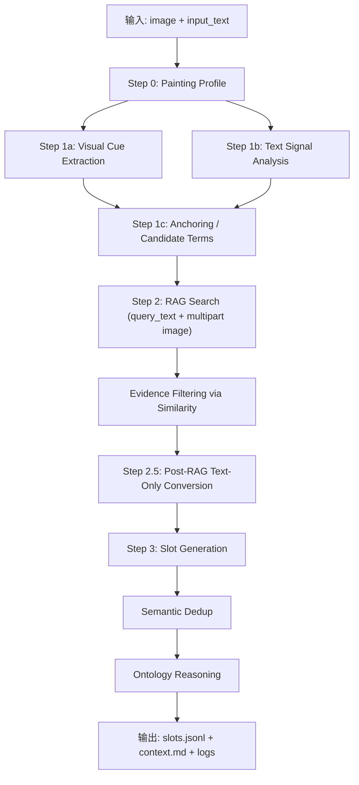
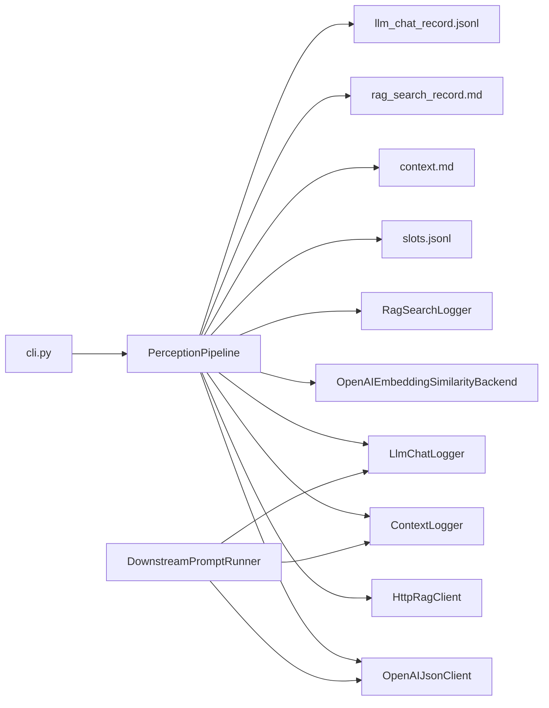

# Perception Layer Technical Report

## 1. 项目目标

本项目用于把“国画图像 + 基础文字信息”转换为结构化领域感知结果，并完成与外部 RAG 的知识对齐。最终输出为可落库的 `slots.jsonl`，同时维护动态本体、RAG 搜索记录和 LLM 调用记录。

核心能力包括：

- 先判断这幅图大致是什么画、主题是什么、相关国画知识点是什么
- 并行抽取视觉线索和文本信号
- 生成可检索的候选术语
- 使用 RAG 检索并过滤证据
- 在 RAG 后转入 text-only 阶段，避免下游再次回到“看图猜测”
- 生成 Slots、问题和本体关系
- 记录完整运行痕迹，便于审计和二次扩展

## 2. 快速使用

### 2.1 CLI 运行主流程

```bash
export OPENAI_API_KEY=your_key

python -m perception_layer.cli \
  --image /Users/ken/MM/Pipeline/preception_layer/images/10340357965d9de3.png \
  --text "请对这幅画进行赏析。" \
  --base-url https://api.zjuqx.cn/v1 \
  --embedding-model baai/bge-m3 \
  --judge-model gemini-3pro \
  --rag-endpoint http://221.12.22.162:8888/test/8002/api/search \
  --output /Users/ken/MM/Pipeline/preception_layer/artifacts/slots.jsonl
```

默认产物：

- `slots.jsonl`
- `artifacts/context.md`
- `artifacts/rag_search_record.md`
- `artifacts/llm_chat_record.jsonl`
- `artifacts/terminal_output.log`

说明：

- 主流程运行时，`llm_chat_record.jsonl` 默认会刷新，只保留这一次主流程的模型调用记录。
- 这是为了保证一次主流程对应一份清晰的聊天记录。

### 2.2 Python API 运行主流程

```python
import asyncio

from perception_layer import PerceptionPipeline, PipelineConfig

config = PipelineConfig(
    api_key="your_key",
    base_url="https://api.zjuqx.cn/v1",
    judge_model="gemini-3pro",
    embedding_model="baai/bge-m3",
    rag_endpoint="http://221.12.22.162:8888/test/8002/api/search",
)

pipeline = PerceptionPipeline(config)
result = asyncio.run(
    pipeline.run(
        image_file="/Users/ken/MM/Pipeline/preception_layer/images/10340357965d9de3.png",
        input_text="请对这幅画进行赏析。",
    )
)
print(result.to_dict())
```

### 2.3 下游扩展调用

下游扩展建议使用新加入的 `DownstreamPromptRunner`，而不是重复跑整条主流程。

```python
import json

from perception_layer import DownstreamPromptRunner, PipelineConfig

config = PipelineConfig(
    api_key="your_key",
    base_url="https://api.zjuqx.cn/v1",
    judge_model="gemini-3pro",
    embedding_model="baai/bge-m3",
)

runner = DownstreamPromptRunner(config)
payload = runner.run_json(
    task_name="补充问题",
    system_prompt="你是中国画鉴赏问题细化器。请基于已有 Slot 补充更细的问题，输出 JSON。",
    user_text=json.dumps(
        {
            "slot_term": "雨点皴",
            "existing_questions": [
                "雨点皴的粗短笔触在表现北方山石质感时有何独特优势？"
            ],
            "goal": "补充两个新的深度问题"
        },
        ensure_ascii=False,
    ),
)
print(payload)
```

下游调用和主流程的差异：

- `DownstreamPromptRunner.run_json()` 默认 `reset_llm_chat_record=False`
- 这意味着下游调用会追加到已有 `llm_chat_record.jsonl`
- 因此不会覆盖主流程已经记录下来的模型会话
- 如确有需要，也可以显式传 `reset_llm_chat_record=True`

## 3. 总体逻辑

### 3.1 执行流程



### 3.2 模块关系



## 4. 核心处理逻辑

### 4.1 Step 0: Painting Profile

先用模型对整幅画做高层判断，生成：

- `painting_type`
- `subject`
- `scene_summary`
- `guohua_knowledge`
- `reasoning`

这一步的目的不是直接输出最终结论，而是给后续锚点抽取提供国画领域先验。

### 4.2 Step 1: 并行粗提取

这里分两路并行：

- 视觉线索提取：只看图像，只抽稳定、可核验的视觉事实
- 文本信号分析：只看输入文字，不引入外部知识

然后把这两部分与 `painting_profile` 一起交给锚定器，生成候选术语。

### 4.3 Step 2: RAG Grounding

每个候选术语都会触发一次 RAG 搜索：

- `query_text = candidate.term`
- `query_image = multipart/form-data` 上传的图像二进制
- `top_k = 配置项`

随后再通过相似度过滤证据，避免把检索到但与当前术语无关的文本直接拿去生成 Slot。

### 4.4 Step 2.5: Post-RAG Text-Only

RAG 结束后，系统会把候选项转换成 text-only 版本：

- 清空 `visual_evidence`
- 聚合 `text_evidence + RAG 文档内容`
- 后续 Slot 生成和本体推理只基于文字证据

这样做的目的，是确保下游不再把视觉猜测反复注入后续描述。

### 4.5 Step 3: Slot Generation

基于术语、描述和 RAG 证据，生成结构化 Slot：

- `slot_name`
- `slot_term`
- `description`
- `specific_questions`
- `metadata`

### 4.6 Semantic Dedup

两个 Slot 如果相似度高于阈值，会被合并。

默认优先使用 embedding 相似度；如果 embedding 接口不可用，则自动回退到本地 lexical similarity。

### 4.7 Ontology Reasoning

对最终 Slots 做父子关系推理，例如：

- `雨点皴 is-a 皴法`
- `诗堂 is-a 装裱形制`

结果会追加到 `context.md`。

## 5. 输入输出结构

### 5.1 主流程输入

主流程最小输入：

```json
{
  "image_file": "/abs/path/to/image.png",
  "input_text": "基础文字信息"
}
```

CLI 常用参数：

```text
--image
--text
--api-key
--base-url
--embedding-model
--judge-model
--rag-endpoint
--rag-top-k
--rag-score-threshold
--duplicate-threshold
--max-image-pixels
--output
--terminal-log
```

### 5.2 主流程输出

`slots.jsonl` 中每一行结构：

```json
{
  "slot_name": "具体领域的名字",
  "slot_term": "术语名称",
  "description": "基于 RAG 整合后的自然语言描述",
  "specific_questions": ["引导鉴赏问题1", "问题2"],
  "metadata": {
    "confidence": 0.92,
    "source_id": "doc-1"
  }
}
```

### 5.3 PipelineResult 结构

Python API 返回 `PipelineResult`，包含：

```json
{
  "slots": [],
  "grounded_terms": [],
  "ontology_links": [],
  "output_path": "...",
  "context_path": "...",
  "rag_search_record_path": "...",
  "llm_chat_record_path": "..."
}
```

### 5.4 下游调用输入

推荐输入：

```json
{
  "task_name": "补充问题",
  "system_prompt": "下游任务 prompt",
  "user_text": "结构化上下文",
  "image_file": null
}
```

下游任务一般不再需要图像；如果必须用图像，也支持额外传入 `image_file`。

### 5.5 下游调用输出

`DownstreamPromptRunner.run_json()` 直接返回模型 JSON：

```json
{
  "new_slots": [],
  "merge_candidates": [],
  "additional_questions": []
}
```

具体结构取决于你传入的下游 prompt。

## 6. 产物与记录文件

### 6.1 `artifacts/slots.jsonl`

最终结构化产物，供落库或后续系统消费。

### 6.2 `artifacts/context.md`

记录运行过程中的关键阶段，包括：

- Run Started
- Painting Profile
- Parallel Extraction
- Anchored Candidates
- RAG Grounding
- Post-RAG Text Extraction
- Semantic Dedup
- Ontology Updates
- Downstream Prompt

### 6.3 `artifacts/rag_search_record.md`

记录每次 RAG 搜索的：

- 输入图片路径
- query_text
- 是否带图
- 返回 source_id
- alignment score

### 6.4 `artifacts/llm_chat_record.jsonl`

记录每次 LLM 调用的：

- `system_prompt`
- `user_text`
- 是否附图
- 图片类型和 base64 长度
- 模型返回 JSON

记录策略：

- 主流程 `PerceptionPipeline.run()` 默认刷新该文件
- 下游 `DownstreamPromptRunner.run_json()` 默认追加该文件

这保证了：

- 主流程记录保持“单次运行可审计”
- 下游扩展不会把主流程的原始记录覆盖掉

### 6.5 `artifacts/terminal_output.log`

保存 CLI 在 terminal 中打印的输出和报错。

## 7. 下游扩展怎么使用

建议流程：

1. 先跑主流程，得到 `slots.jsonl`、`context.md` 和 `llm_chat_record.jsonl`
2. 根据新增需求，整理当前要补充的目标
3. 读取已有 Slots 和证据，构造成新的 `user_text`
4. 使用 `DownstreamPromptRunner.run_json()` 调用下游 prompt
5. 视情况把结果转成新的 Slot、补充问题或补链关系

典型下游任务：

- 补某个术语的更多问题
- 基于新 RAG 证据补新 Slot
- 判断新增术语该合并到哪个旧 Slot
- 补本体关系

推荐参考文档：

- `downstream_prompt_guidelines.md`

## 8. 关键工程约束

- Step 1 的视觉与文本分析是并行执行的
- 图像在上传前会按 `max_image_pixels` 缩放
- RAG 图像上传使用 `multipart/form-data`
- RAG 后默认只保留文字证据进入下游
- embedding 异常时自动降级为 lexical similarity
- 主流程和下游扩展采用不同的聊天记录保留策略

## 9. 代码落点

关键实现文件：

- `perception_layer/pipeline.py`: 主流程
- `perception_layer/downstream.py`: 下游扩展入口
- `perception_layer/clients.py`: LLM / RAG / similarity 客户端
- `perception_layer/config.py`: 默认配置
- `perception_layer/models.py`: 核心数据结构
- `perception_layer/cli.py`: 命令行入口
- `downstream_prompt_guidelines.md`: 下游 prompt 约束文档

## 10. 推荐实践

- 如果是“重新分析一幅画”，用主流程
- 如果是“在已有结果上补任务”，用下游入口
- 如果下游只是补问题，不要再次跑整条 RAG
- 如果下游必须补证据，先生成更稳的检索词，再局部调用 RAG
- 如果新增内容与旧 Slot 高度相近，优先合并而不是重复新增
